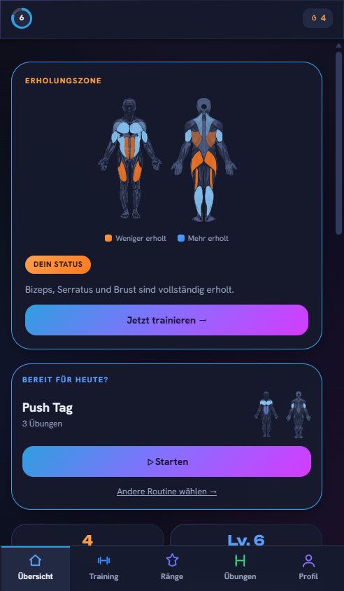
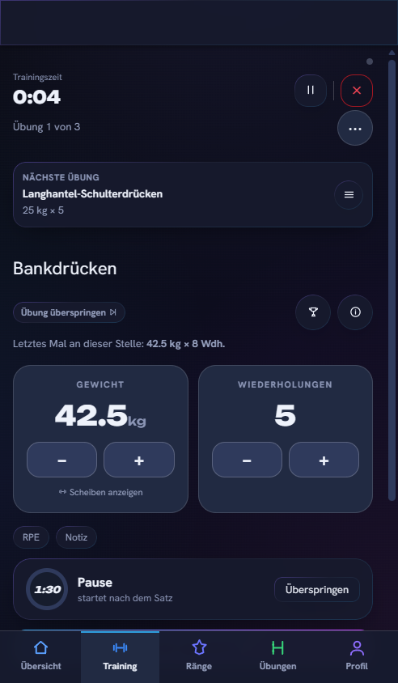
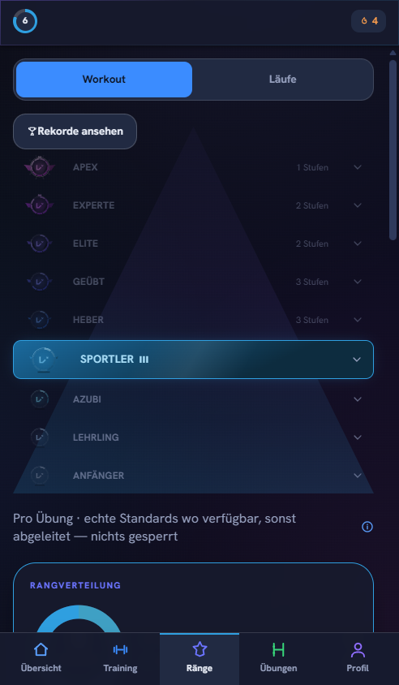
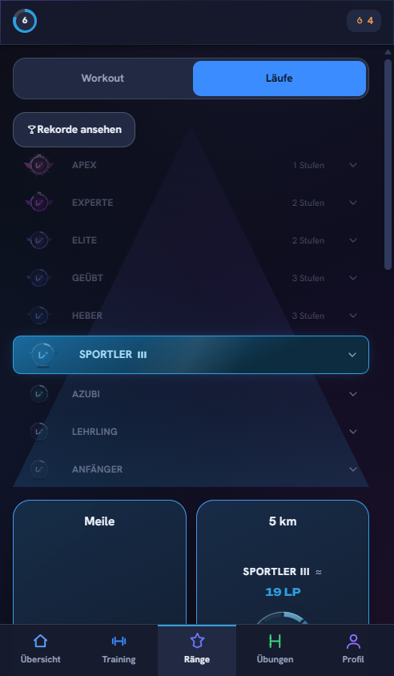

<p align="center">
  <a href="LICENSE"></a>
  <a href="https://github.com/LetsGaming/liftr/actions/workflows/ci.yml"></a>
  <a href="https://github.com/LetsGaming/liftr/releases/latest"></a>
  
  
</p>

# Liftr

**A self-hosted, open-source workout and running tracker that gives every lift a real rank —
so progress is something you can see, not just something you hope is happening.**

Liftr is a strength- and running-tracker PWA you run on your own hardware: log sets and runs from
your phone, get a rank per exercise built on real strength standards (or an honest, clearly-marked
estimate where none exist), and keep every rep in one SQLite file that never leaves your network
unless you say so. No ads, no analytics, no subscription, no cloud account required — install it
to your home screen like a native app and it works even with zero signal in the gym.

<p align="center"><sub>Free. Open source. Runs on hardware you already own.</sub></p>

## See it

<p align="center">
  
  
  
  
</p>

## Get it running

```bash
cp .env.example .env
docker compose up --build -d
```

Open `http://localhost:3001/` — first visit prompts the owner to set a password, no token or
extra config needed. From there, invite anyone else in your household via a time-limited code
from the members screen; everyone gets their own login.

<details>
<summary><b>Running from source instead</b></summary>
<br>

```bash
pnpm install
pnpm dev
```

That starts the Fastify API and the Vue client together against a local SQLite file. See
[`docs/operations/docker-deployment.md`](docs/operations/docker-deployment.md) for the full
production/Docker path (backups, updates, reverse-proxy notes) and
[`docs/guides/local-development.md`](docs/guides/local-development.md) for contributing to the
codebase itself.

</details>

## The core loop


Open the app mid-workout, not before it. Start a routine and the set you're about to do is already
on screen, last time's weight and reps right next to the input, so you never have to think "what
did I lift last week." Log it in one or two taps.

Every lift has a rank, based on real strength standards where they exist and honest estimates
where they don't (marked with a small `≈`, no pretending). Hit a rank once and it's locked in as
your peak for good, even if your bodyweight shifts. Your current rank can soften if you stop
training a lift for a while, then snaps right back the moment you log one real set again. No
re-climbing, just a reason to come back.

The Recovery Zone reads your recent training load and tells you plainly if today's a green light
or a rest day. Streaks survive a missed day, because the point is protecting motivation, not
punishing a Tuesday.

## What's in it

-  **A rank for almost every lift**, not just squat/bench/deadlift — nine tiers, real strength standards
-  **Runs, walks, and hikes count too** — import GPX/FIT from any watch or Health Connect, no Strava required, each with its own pace-based rank
-  **Installable PWA that works offline.** Log a set in a basement gym with zero signal, it syncs later
-  **Self-hosted, no ads, no analytics** — the whole household can have their own login, and your training data stays on your own server
-  **One SQLite file.** Back it up, move it, own it

## The ladder

| Tier | What it means |
|---|---|
| Initiate | You showed up and logged real numbers. Everyone starts here. |
| Apprentice | Building a real base. |
| Trainee | Training with real weight, momentum building. |
| Athlete | Consistent, solid lifting — the floor most lifters live on. |
| Lifter | Visibly, genuinely strong. |
| Advanced | Strong relative to standard, the tier that starts turning heads. |
| Elite | Rare air. |
| Expert | The standards here assume years of dedicated training. |
| Apex | The top of the curve. One real milestone, not another grind — getting here on even one lift is a genuine feat. |

Nine tiers per exercise, each split into divisions — more of them near the bottom (Initiate has
five) so early rank-ups come often, tapering to a single division at Apex, plus one **Overall
Rank** that rolls your strongest lifts into a single headline number.

## Why it's built this way

Progression only stays motivating if it's honest. A rank that goes up for reasons you don't
understand, or vanishes for reasons outside your control, stops feeling like a game and starts
feeling like noise. Every design call in Liftr (the peak/current split, the trust markers on
estimated numbers, the streak forgiveness) exists to keep the numbers fair.

## Who it's for

You want a **Hevy**, **Strong**, or **Strava**-style tracker, but you'd rather own the database than
trust a company's roadmap with your training history. Liftr trades a polished multi-platform app
store presence for that ownership: it's a single-maintainer, pre-v1 project, self-hosted only, with
no companion cloud service and no plans for one. If that trade sounds right, it's built for you.

## Documentation

| | |
|---|---|
| [`docs/README.md`](docs/README.md) | Full documentation map |
| [`docs/ARCHITECTURE.md`](docs/ARCHITECTURE.md) | How the app is put together |
| [`docs/reference/http-api.md`](docs/reference/http-api.md) | HTTP API reference |
| [`docs/operations/docker-deployment.md`](docs/operations/docker-deployment.md) | Deploying for real |
| [`docs/guides/local-development.md`](docs/guides/local-development.md) | Local dev setup |
| [`docs/ROADMAP.md`](docs/ROADMAP.md) | What's shipped, what's open |

Tests live under `tests/`, mirroring the package layout (`tests/server/services/foo.test.ts` for
`packages/server/src/services/foo.ts`, and so on) — run them with `pnpm test`; see
`tests/README.md` for the conventions if you're adding to them.

## Contributing

Issues and PRs are welcome — see [`docs/CONTRIBUTING.md`](docs/CONTRIBUTING.md) for the workflow
this repo actually enforces, and please follow the [Code of Conduct](CODE_OF_CONDUCT.md). Found a
vulnerability? See [`docs/SECURITY.md`](docs/SECURITY.md) for how to report it.

## License

Liftr is licensed under [AGPL-3.0](LICENSE): self-host it freely, fork it, modify it — but if you
run a modified copy of Liftr as a service for other people, you must make your source available to
them too.

## Stack

Vue 3 + Ionic/Capacitor (installable PWA) · Fastify + SQLite/Drizzle · TypeScript throughout, in a pnpm monorepo.

---

<p align="center"><sub>One household's home gym, one server, no third parties in between.*</sub> </p>

<sub>\* With one opt-in exception: planned-route creation can call OpenRouteService for road-snapped
distance/elevation if you set `LIFTR_ORS_API_KEY` — unset by default, gracefully degrades to
straight-line distance, and self-hostable via `LIFTR_ORS_BASE_URL` to remove the third party
entirely. See [docs/SECURITY.md](docs/SECURITY.md#outbound-requests-openrouteservice) and
[ADR 0007](docs/adr/0007-openrouteservice-external-routing-exception.md).</sub>
