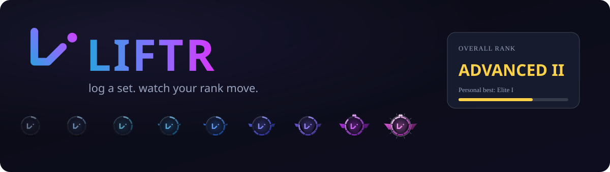
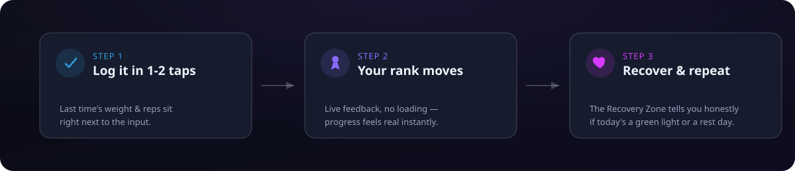

<p align="center">
  
  
  
  
</p>

# Liftr

Log a set, watch your rank move. That's the whole loop.

Liftr is a self-hosted strength and running tracker. Most workout apps either have a progression
system worth caring about and are miserable to use, or they're polished and forgettable. Liftr is
an attempt at the first one without the second: private, ad-free, no account, and it turns "did I
get stronger" into something you can actually see, one set at a time.

The rank system is the retention mechanic — that's the whole design rule. Everything else exists
to make logging a set fast enough that using the app doesn't feel like a chore.

## The core loop



## What it feels like to use

Open the app mid-workout, not before it. Start a routine and the set you're about to do is already on screen, last time's weight and reps sitting right next to the input, so you never have to think "what did I lift last week." Log it in one or two taps. That's the whole interaction the app is built around, and nothing gets added on top of it that would slow that down.

Every lift has a rank — nine tiers from Initiate to Apex, with divisions inside each tier (more divisions at the bottom for frequent early rank-ups, down to a single division at Apex — one real milestone, not another grind), based on real strength standards where they exist (bodyweight-relative lifts, barbell classics) and honest estimates where they don't. When an estimate is doing the guessing, the app marks it with a small `≈` instead of pretending to a precision it doesn't have.

Once you hit a rank, it's locked in as your peak. The app won't quietly take it back from you, even if your bodyweight shifts or an old standard turns out to have been miscalibrated. Your *current* rank is a separate number: it softens a little if you stop training a lift for a few weeks — three weeks off costs you a division, not the whole tier — and it snaps straight back the moment you log one real set. No re-climbing, no second grind, just a reason to come back.

Beyond your individual lift ranks — nearly every exercise in the catalog gets one, not just a handful of barbell classics — Liftr rolls your strongest, most-trusted lifts into a single Overall Rank, weighted toward your real barbell numbers so one obscure accessory exercise can't drag it around.

The Recovery Zone looks at your recent training load and tells you plainly whether today is a green light or a rest day — a heuristic, not a claim to know your physiology better than you do. Streaks work on the same logic: miss a day and the streak survives, because the point is protecting motivation, not punishing a Tuesday.

Runs count too. Import GPX or FIT files from any watch or app you already have — no Strava account, no third-party API required.

None of it leaves your hands, either. No cloud account, no analytics, no feed to perform for. Liftr runs on your own server, keeps its data in a single SQLite file you can back up or take with you, and works offline as an installable PWA — log a set with zero signal in a basement gym and it syncs once you're back online.

## The ladder

| Tier | What it means |
|---|---|
| Initiate | You showed up and logged real numbers. Everyone starts here. |
| Apprentice | Building a real base. |
| Trainee | Training with real weight, momentum building. |
| Athlete | Consistent, solid lifting — the floor most lifters live on. |
| Lifter | Visibly, genuinely strong. |
| Advanced | Strong relative to standard, the tier that starts turning heads. |
| Elite | Rare air. |
| Expert | The standards here assume years of dedicated training. |
| Apex | The top of the curve. One real milestone, not another grind — getting here on even one lift is a genuine feat. |

Nine tiers per exercise, each split into divisions — more of them near the bottom (Initiate has
five) so early rank-ups come often, tapering to a single division at Apex, plus one **Overall
Rank** that rolls your strongest lifts into a single headline number.

## Why it's built this way

Progression only stays motivating if it's honest. A rank that goes up for reasons you don't
understand, or vanishes for reasons outside your control (a bodyweight fluctuation shouldn't cost
you a rank you legitimately earned), stops feeling like a game and starts feeling like noise. The
peak/current split, the trust markers on estimated numbers, the streak forgiveness — all three
exist for the same reason: to keep the numbers fair.

## Getting it running

Liftr is self-hosted — you run it on your own machine or home server, and it stays entirely on your network unless you choose to expose it.

```bash
pnpm install
pnpm dev
```

That starts the Fastify API and the Vue client together.

<details>
<summary><b>Deploying for real (production, behind your own reverse proxy)</b></summary>
<br>

Set a `LIFTR_TOKEN` (the single bearer token that gates access — there are no user accounts to manage) and point `LIFTR_DB_PATH` at where you want the SQLite file to live, then:

```bash
pnpm build
```

Install it to your phone's home screen from the browser's "Add to Home Screen" prompt — no app store required.

</details>

Tests live under `tests/`, mirroring the package layout (`tests/server/services/foo.test.ts` for
`packages/server/src/services/foo.ts`, and so on) — run them with `pnpm test`; see
`tests/README.md` for the conventions if you're adding to them.

See [`docs/`](docs/) for the full documentation suite — architecture, the HTTP API reference,
environment variables, and guides for local development, adding an exercise, and releasing —
if you're working on the codebase itself. (`audit/finished/liftr-audit.md` is the original,
point-in-time architecture audit `docs/ARCHITECTURE.md` builds on — still worth a read for the
full "why", but `docs/` is the maintained reference going forward.)

## Stack

Vue 3 + Ionic/Capacitor (installable PWA) · Fastify + SQLite/Drizzle · TypeScript throughout, in a pnpm monorepo.

---

<p align="center"><sub>One lifter's home gym, one server, no third parties in between. 🏋️</sub></p>
