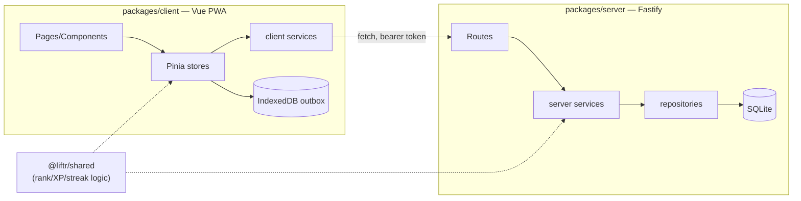

# Architecture

## Repo layout

A pnpm workspace, five packages under `packages/`:

| Package | What it is |
|---|---|
| `shared` | Pure, DB-free domain logic — the rank engine, XP/streak math, e1RM estimation, equipment resolution, routine-building. No I/O. Both client and server import it directly by package name (`@liftr/shared`); its `package.json` `exports` map points straight at `src/`, so there's no build step to consume it. |
| `db` | The one Drizzle/SQLite schema (`src/schema.ts`) and a migration runner. Both `server` (real db) and `ingest` (writes the catalog) depend on it. |
| `server` | Fastify API. Owns the single SQLite db (`src/db.ts`), all HTTP routes, and the "authoritative" recompute path for ranks. |
| `client` | Vue 3 + Ionic/Capacitor PWA. Installable both as a browser PWA and (via `packages/client/android`, see [operations/android-release-signing.md](operations/android-release-signing.md)) as a sideloaded Android APK. Android's Health Connect import runs through a pnpm-patched fork of `capacitor-health` (`patches/capacitor-health.patch`, wired via `patchedDependencies` in `pnpm-workspace.yaml`) that fixes an upstream Health Connect permission-string bug (`READ_EXERCISE_ROUTE` singular instead of the plural `READ_EXERCISE_ROUTES`). |
| `ingest` | Offline CLI tooling that builds the exercise catalog (`tools/catalog/curated.yaml`) into the db and downloads/generates catalog assets (photos, muscle-map SVGs, i18n strings). Not part of the running app — see [guides/adding-an-exercise.md](guides/adding-an-exercise.md). |

`tools/catalog/curated.yaml` is the one hand-maintained data file the whole rank system is
anchored to — see its own header comment and
[concepts/catalog-and-equipment.md](concepts/catalog-and-equipment.md).

## Runtime shape

The rank/XP/streak math in `@liftr/shared` is **duplicated at runtime, not duplicated in code** —
the client runs it optimistically offline (e.g. previewing a rank-up the instant a set is logged,
before the server round-trip completes) and the server runs the exact same functions
authoritatively once the write lands, via `packages/server/src/recompute.ts` and the per-exercise
`rankService.recomputeRankForExercise`. Because both sides import the same pure functions from one
package, they can't drift — there's no separate "client rank formula" and "server rank formula" to
keep in sync by hand.

## Data model

`packages/db/src/schema.ts` is the single source of truth for the schema; skim it directly rather
than trusting a table list here to stay current. Broad shape: `users`, `sessions`, and
`invite_codes` are the multi-user/auth model; `exercises` (+ `exercise_muscles`, `muscles`) is the
catalog; `workouts` → `workout_exercises` → `sets` is a logged session; `routines` →
`routine_exercises` (+ `mesocycles`) is a plan; `ranks`/`standards`/`rank_events` are the strength
rank engine's own state, mirrored for running by `run_standards`/`run_ranks`/`run_rank_events`;
`runs`/`run_points` are logged runs, with `planned_routes`/`planned_route_points` holding
routes planned ahead of time; `bodyweight_logs`, `prs`/`run_prs`, `streaks`, `settings`, and
`error_logs` (the diagnostics ring buffer, see below) round out the rest. Foreign keys use real
`onDelete` cascade/restrict/set-null behavior (see `tests/db/schema.test.ts` for what's actually
enforced) — this isn't a soft-delete/orphan-tolerant schema.

Unexpected 500s fan out to two sinks: a DB-backed ring buffer (`error_logs`), surfaced to the owner
at `GET /api/diagnostics/errors`, and a JSON-lines file at `<dirname(LIFTR_DB_PATH)>/logs/errors.log`.

## Server

`packages/server/src/app.ts`'s `buildApp()` wires up validation (Zod via
`fastify-type-provider-zod`), one central error handler (typed `NotFoundError`/`ConflictError` →
404/409, Zod validation failures → 400, everything else → 500 with no leaked internals), CORS,
static file serving (catalog images + the built client in production), a single `requireAuth` hook
(`src/auth.ts`, see [SECURITY.md](SECURITY.md)) that resolves a bearer session token to a
per-user identity — no shared token — and then registers one `register*Routes` function per
resource from `src/routes/`.

The global auth hook only *skips* a short, hardcoded list of URL strings in `app.ts`
(`/api/auth/status`, `/api/auth/setup`, `/api/auth/login`, `/api/auth/register`, `/api/health`) —
there's no per-route "public" flag, so a new public route has to be added to that list by hand or
it'll 401.

Each route file is a thin HTTP-shape layer over a
`src/services/*.ts` function, which in turn composes one or more `src/repositories/*.ts` functions
(the only layer that talks Drizzle). `configureApp()` (the validation/error-handler wiring, minus
the db singleton/CORS/static setup) is extracted specifically so tests can stand up a real,
isolated Fastify instance against an in-memory db — see `tests/server/helpers/testApp.ts`.

Full endpoint-by-endpoint shape: [reference/http-api.md](reference/http-api.md).

## Client

Vue 3 (Composition API) + Ionic Vue for the UI shell, Pinia for state, `vue-router`
(`packages/client/src/router.ts`) for 10 routes total — 5 of them the top-level tab/nav
destinations (Overview / Workout / Ranks / Exercises / Profile), the rest (`/runs`, `/records`,
`/routines/:id`, `/routes/:id`, and `/attributions`) drill-ins reached from within those rather
than shown in primary navigation. `src/stores/` hold one Pinia store per
domain, most of them a thin load/cache wrapper around a matching `src/services/*.ts` (the HTTP
boundary, all going through `src/lib/api.ts`). `src/composables/` hold reusable stateful logic
that isn't tied to a global store (timers, drag-reorder math, form/wizard state). Offline-first is
real, not cosmetic: `syncStore.ts` queues writes in IndexedDB (`src/lib/idb.ts`) when offline and
flushes them once connectivity returns — see
[concepts/sync-and-offline.md](concepts/sync-and-offline.md) for the queue/chunking/retry design
(there's a real prior-bug story behind why it chunks).

## Testing

`tests/` mirrors `packages/*/src` at the top level — see [tests/README.md](../tests/README.md) for
the full convention doc (import aliases, shared test helpers, environment rules). CI
(`.github/workflows/ci.yml`) runs typecheck + lint + the full test suite on every push/PR; it's
also reused as the test gate inside the release workflow (below) via `workflow_call`.

## Release

`.github/workflows/release.yml`, triggered by pushing a `vX.Y.Z` tag: runs the same CI test gate,
then builds the client, syncs it into the Capacitor Android project, builds a signed release APK,
and attaches it to a GitHub Release. See
[operations/android-release-signing.md](operations/android-release-signing.md) for the one-time
keystore setup and [guides/running-on-a-phone.md](guides/running-on-a-phone.md) for the install
path (PWA vs. sideloaded APK).
